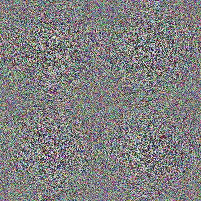

# Random Image Generator

[](https://travis-ci.org/davidpadbury/random-image-generator)

An [npm](http://npmjs.org) module for generating random images. Intended for use in automated tests that require unique images.

Currently only supports generating very noisy JPEGs.

Available as both a node module in code and a command line tool.

## Example



## Usage

### JavaScript

```javascript
var randomImageGenerator = require('random-image-generator'),
    fs = require('fs');

/**
 * Takes a width and height parameter
 * Returns a Buffer containing a JPEG image
 */
randomImageGenerator(800, 600, function(err, image) {
    fs.writeFile('random-image.jpg', image, function(err) {
        // done, hopefully
    });
});
```

### Command Line

```
npm install -g random-image-generator

random-image-generator 800 600 > random-image.jpg
```
